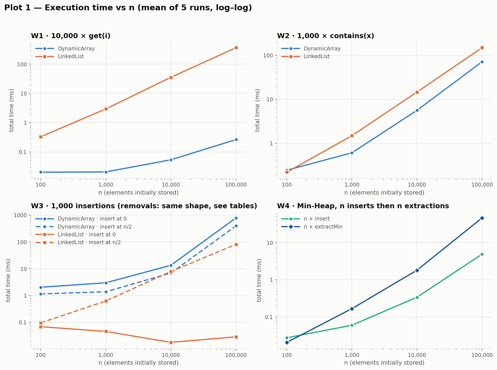
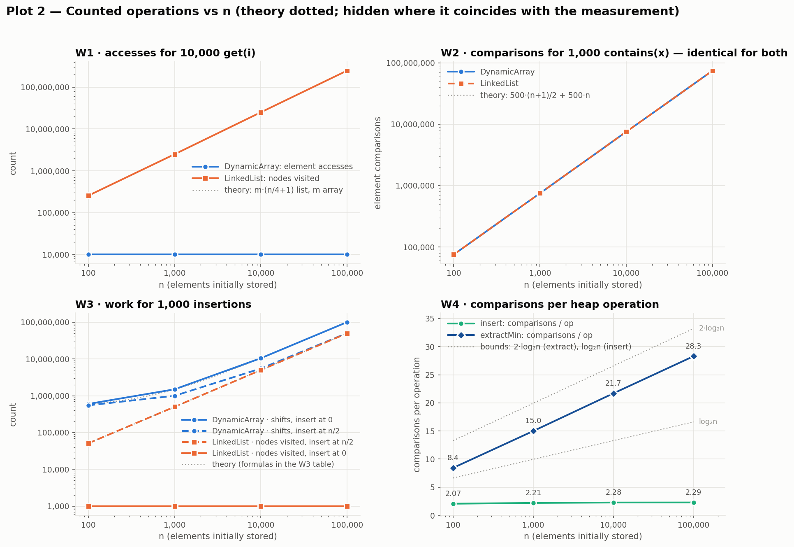
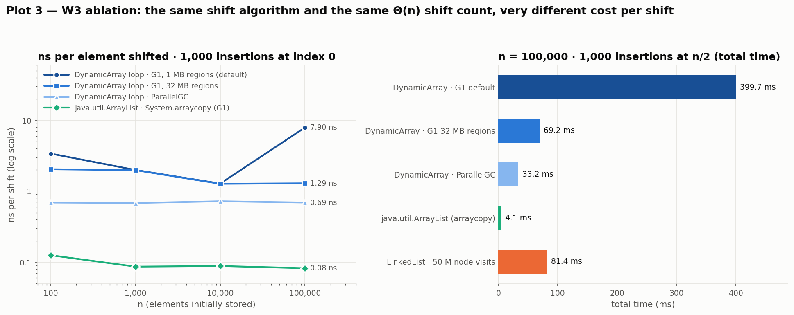
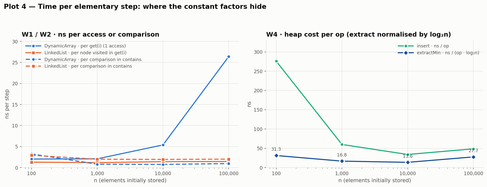

# Assignment 2 — Algorithmic Analysis, Correctness and Performance Trade-offs

Three data structures (**Dynamic Array**, **Linked List** and **Min-Heap**) are implemented from scratch in Java. The report proves two of their operations correct with loop invariants and derives O/Ω/Θ bounds for every required operation. It then tests those bounds against a reproducible benchmark of the four required workloads.

```
javac -encoding UTF-8 -d out src/*.java
java -cp out Tests                                   # 139 correctness checks
java -Xms1g -Xmx1g -XX:+UseG1GC -cp out Benchmark    # all workloads -> results/tables/
python3 scripts/plot_results.py                      # plots -> results/plots/
```
`./run_benchmark.sh` (or `run_benchmark.bat` on Windows) reproduces every table and plot in this report, including the two W3 ablation runs. The whole run takes under a minute. Requirements: JDK 17 or newer, plus Python 3 with matplotlib for the plots.

**Contents:** [1 Overview](#1-overview) · [2 Complexity analysis](#2-complexity-analysis) · [3 Correctness](#3-correctness-loop-invariants) · [4 Experimental setup](#4-experimental-setup) · [5 Results](#5-results) · [6 Discussion](#6-discussion) · [7 Design recommendations](#7-design-recommendations) · [8 Conclusion](#8-conclusion) · [Testing](#testing-and-correctness-validation) · [Repository layout](#repository-layout)

---

## 1. Overview

The assignment compares three ways of organising the same data in memory. It checks whether their textbook complexities predict how fast they are in practice.

| Class | Physical organisation | Key implementation decisions |
|---|---|---|
| `DynamicArray<T>` | One contiguous `Object[]` plus `size` | Capacity doubles when full (amortized Θ(1) append); no shrinking (same as `java.util.ArrayList`). Shifts are done element by element in an explicit loop, which is the loop proved in §3.1. The vacated slot is nulled on `remove` so that the GC can reclaim it. Indices are checked **before** any mutation. |
| `LinkedList<T>` | Doubly linked `Node{value, prev, next}` objects, with `head`, `tail` and `size` | `add(x)` appends through `tail` in Θ(1). `node(i)` walks from **whichever end is closer**, so the middle is the worst position (⌈n/2⌉ hops) and both ends cost Θ(1). Insertion and removal only rewire pointers; no element is ever moved. |
| `MinHeap<T extends Comparable>` | Implicit binary tree in a growable array: children of `i` are `2i+1` and `2i+2` | `insert` does sift-up and `extractMin` does sift-down (proved in §3.2). Both loops are iterative and swap-based. `null` is rejected. `isValidHeap()` checks every parent–child edge and is used by the tests. |

Both lists implement the small interface `IndexedList<T>` (`add(x)`, `add(i,x)`, `remove(i)`, `get(i)`, `contains(x)`), so they share one test suite. The only intended difference between them is cost. No `java.util` collection is used inside the three structures; JDK collections appear only in `Tests.java` (as oracles) and in an optional reference section of the benchmark.

Every structure counts its own elementary operations. The benchmark compares these counts with the theory:

| Counter | DynamicArray | LinkedList | MinHeap |
|---|---|---|---|
| `accesses` | element slots read or written directly (1 per `get`) | **nodes visited**: `min(i, n−1−i)+1` per positional lookup | – |
| `comparisons` | equality tests in `contains` | equality tests in `contains` | `compareTo` calls in sift-up and sift-down |
| `movements` | elements copied: shifts plus resize copies | always 0 (nothing moves) | swaps |

The counters are updated arithmetically, once per operation (for example `movements += size − index`), and not inside the hot loops. This way the counters barely perturb the timings they sit next to.

---

## 2. Complexity analysis

Notation: n = current number of elements and i = the index argument. Each **case** (best, average, worst) is stated as a tight Θ bound. The **overall** column states the operation's behaviour over *all* inputs with O (upper bound) and Ω (lower bound); where best and worst differ, no single Θ describes the operation as a whole.

| Structure | Operation | Best | Average | Worst | Overall | Aux. space |
|---|---|---|---|---|---|---|
| Dynamic Array | `add(x)` | Θ(1) | Θ(1) amortized | Θ(n) (resize) | O(n) per call, **Θ(1) amortized**; Ω(1) | Θ(1) amortized (Θ(n) transient buffer during a resize) |
| Dynamic Array | `add(i, x)` | Θ(1) (i = n, no resize) | Θ(n) | Θ(n) (i = 0) | O(n), Ω(1) | Θ(1) (+Θ(n) if it resizes) |
| Dynamic Array | `remove(i)` | Θ(1) (i = n−1) | Θ(n) | Θ(n) (i = 0) | O(n), Ω(1) | Θ(1) |
| Dynamic Array | `get(i)` | Θ(1) | Θ(1) | Θ(1) | **Θ(1)** | Θ(1) |
| Dynamic Array | `contains(x)` | Θ(1) (x at index 0) | Θ(n) | Θ(n) (x absent) | O(n), Ω(1) | Θ(1) |
| Linked List | `add(x)` | Θ(1) | Θ(1) | Θ(1) | **Θ(1)** | Θ(1) (one node) |
| Linked List | `add(i, x)` | Θ(1) (i = 0 or i = n) | Θ(n) | Θ(n) (i ≈ n/2) | O(n), Ω(1) | Θ(1) |
| Linked List | `remove(i)` | Θ(1) (i = 0 or n−1) | Θ(n) | Θ(n) (i ≈ n/2) | O(n), Ω(1) | Θ(1) |
| Linked List | `get(i)` | Θ(1) (either end) | Θ(n) | Θ(n) (i ≈ n/2) | O(n), Ω(1) | Θ(1) |
| Linked List | `contains(x)` | Θ(1) (x at head) | Θ(n) | Θ(n) (x absent) | O(n), Ω(1) | Θ(1) |
| Min-Heap | `insert(x)` | Θ(1) (x ≥ its parent) | Θ(1) expected for random keys | Θ(log n) (x is a new minimum) | O(log n) amortized, Ω(1) | Θ(1) amortized |
| Min-Heap | `peekMin()` | Θ(1) | Θ(1) | Θ(1) | **Θ(1)** | Θ(1) |
| Min-Heap | `extractMin()` | Θ(1) (e.g. all keys equal) | Θ(log n) | Θ(log n) | O(log n), Ω(1) | Θ(1) (iterative sift-down) |

Storage for the whole structure is Θ(n) in all three cases. The constants differ, though. With compressed references (the default for heaps under 32 GB), the array stores a 4-byte reference per element and keeps up to 2× slack capacity, while every list element costs a 24-byte `Node`. In both cases the boxed `Integer` (16 bytes) comes on top.

**Justification per operation**

- **Array `get(i)`**: the address is `base + 4·i`, a single computation independent of n.
- **List `get(i)`**: there is no address arithmetic, so the list must follow `min(i, n−1−i)` pointers. For a uniformly random i the expected walk is about n/4 hops, which is Θ(n); the middle is the worst case at ⌈n/2⌉.
- **Array `add(i, x)` / `remove(i)`**: exactly `n − i` (or `n − 1 − i`) elements are shifted, which §3.1 proves. For a uniform i the mean is n/2 = Θ(n). At the end nothing moves (best case Θ(1)).
- **List `add(i, x)` / `remove(i)`**: the splice itself is Θ(1) (four pointer writes). Locating position i costs the same Θ(min(i, n−i)) as `get`. The often-quoted "O(1) insertion into a linked list" is true only when you already hold the node.
- **`add(x)` on the array**: most calls write one slot. A resize copies all n elements, but resizes happen at sizes 8, 16, 32, …, so the total copying over n appends is < 2n. This gives amortized Θ(1) and a Θ(n) worst case for a single call.
- **`contains(x)` (both)**: a linear scan with one comparison per inspected element. A hit at position k costs k+1 comparisons, so a uniformly placed hit costs (n+1)/2 on average. A miss costs n. Both are Θ(n).
- **Heap `insert`**: sift-up moves along one root-to-leaf path of height ⌊log₂ n⌋, which bounds the worst case at Θ(log n) (reached when every new key is smaller than all others). For keys arriving in random order, the expected number of levels climbed is bounded by a constant (Porter & Simon, 1975). The measurement confirms this: about 1.3 swaps and 2.3 comparisons per insert, independent of n (§5.4).
- **Heap `peekMin`**: returns `heap[0]`; the heap property guarantees the root is the minimum.
- **Heap `extractMin`**: the last leaf is moved to the root and sifted down. This costs at most 2 comparisons per level over ⌊log₂ n⌋ levels, so at most 2⌊log₂ n⌋ comparisons. Because the moved leaf is typically a large key, it sinks almost to the bottom: the measured average is 89–96% of the worst-case bound (§5.4), so the average case is also Θ(log n).

**Operations that look alike but cost very different amounts in practice**

| Looks similar | Why it isn't |
|---|---|
| `get(i)` on array vs. list | Θ(1) vs. Θ(n). Measured at n = 100,000: 26 ns vs. 36 µs per call (**1,368×**). |
| `contains(x)` on array vs. list | Both Θ(n), and the measured **comparison counts are identical**. The list is still about 2–2.6× slower per comparison: array loads are independent and can be pipelined, while list loads form a dependent pointer chain. |
| `add(0, x)` vs. `add(n/2, x)` on the list | Both are "list insertions", but the first is Θ(1) and the second is Θ(n) because *finding* the spot dominates. |
| `add(n/2, x)` on array vs. list | Both Θ(n), but for different reasons: the array **writes** n/2 contiguous slots, while the list **reads** n/2 scattered nodes. Which one is faster depends on constants, and §5.3 shows those constants range over two orders of magnitude. |
| `add(x)` on the array | Usually one write; occasionally a full Θ(n) copy (the amortized/worst-case gap). |
| Heap `insert` vs. `extractMin` | Both are O(log n) worst case. In practice, however, insert needs ≈ 2.3 comparisons, while extract needs ≈ 2 log₂ n (28 at n = 100,000): **12× more**. |

---

## 3. Correctness (loop invariants)

### 3.1 `DynamicArray.add(index, x)`: the shift loop

```java
checkPositionIndex(index);            // 0 <= index <= size, else throw (nothing modified)
ensureCapacity(size + 1);             // data.length >= size + 1, contents preserved
for (int j = size; j > index; j--) {
    data[j] = data[j - 1];
}
data[index] = x;
size++;
```

Let s = `size` and A[0..s−1] be the list contents **before** the call. The precondition checked in the first line is 0 ≤ index ≤ s. `ensureCapacity` only copies `data[0..s−1]` into a larger array, so afterwards `data[0..s−1] = A[0..s−1]` and slot `data[s]` exists.

**Loop invariant I(j).** Every time the guard `j > index` is evaluated:

1. `data[0..j−1] = A[0..j−1]`: the prefix is untouched.
2. `data[j+1..s] = A[j..s−1]`: the suffix has been shifted right by exactly one slot.
3. index ≤ j ≤ s.

**Initialization.** Before the first test, j = s. (1) reads `data[0..s−1] = A[0..s−1]`, which holds as noted above. (2) concerns `data[s+1..s]`, an empty range, so it holds trivially. (3) index ≤ s is the precondition.

**Maintenance.** Assume I(j) and that the guard holds (j > index). The body executes `data[j] = data[j−1]`. Since j−1 lies in the prefix, (1) gives `data[j−1] = A[j−1]`, so after the assignment `data[j] = A[j−1]`. Joining this slot to (2) gives `data[j..s] = A[j−1..s−1]`, which is statement (2) for j−1: `data[(j−1)+1..s] = A[j−1..s−1]`. The only slot written was j, which lies outside `0..j−2`, so `data[0..j−2] = A[0..j−2]` is still true; that is statement (1) for j−1. Finally j > index implies j−1 ≥ index, so (3) holds for j−1. The decrement `j--` therefore re-establishes I(j−1).

**Termination.** j starts at s and decreases by exactly 1 per iteration. By (3) it never drops below index, so the guard fails when j = index. That happens after exactly **s − index** iterations, a finite number. (This is also where the Θ(n − index) cost and the `movements += size − index` counter come from.)

**Why the invariant proves correctness.** At exit j = index, and I(index) says:
`data[0..index−1] = A[0..index−1]` and `data[index+1..s] = A[index..s−1]`.
The next two statements set `data[index] = x` and `size = s+1`. Hence

> `data[0..s] = A[0..index−1] · x · A[index..s−1]`,

which is exactly the specification of inserting x at position `index`: x ends up at `index`, every old element keeps its relative order, and no element is lost or duplicated. Invalid indices throw before any state changes, which the tests check ("failed calls leave the list unchanged"). `remove(index)` uses the mirror-image loop (`data[j] = data[j+1]` for j = index … s−2), whose invariant is `data[index..j−1] = A[index+1..j]` with `data[j..s−1] = A[j..s−1]`.

### 3.2 `MinHeap.extractMin()`: the sift-down loop

```java
T min = heap[0];                      // (heap was valid, size = s >= 1)
size--;                               // s' = s - 1
heap[0] = heap[size];  heap[size] = null;
if (size > 0) siftDown(0);
return min;

void siftDown(int i) {
    while (true) {
        int left = 2*i + 1;
        if (left >= size) break;                               // (T1) i is a leaf
        int smaller = (left+1 < size && heap[left+1] < heap[left]) ? left+1 : left;   // '<' = compareTo
        if (heap[smaller] >= heap[i]) break;                   // (T2) heap[i] <= both children
        swap(i, smaller);
        i = smaller;
    }
}
```

*Definitions.* For a position c ≥ 1 with c < s′, the **edge** (p, c) connects c to its parent p = ⌊(c−1)/2⌋. An edge is **good** if `a[p] ≤ a[c]`. The **heap property P** says that every edge is good. Along any path to the root, P makes the values non-increasing, so under P the root holds a minimum. Let H be the (valid) heap before the call. `min = H[0]` is therefore a minimum of H.

**Loop invariant J(i).** At the start of each iteration of `siftDown`:

- **(J1)** `a[0..s′−1]` holds exactly the multiset H minus one copy of `min`.
- **(J2)** every edge (p, c) with **p ≠ i** is good. Only the edges from i down to its children may be bad.
- **(J3)** if i > 0, then `a[parent(i)] ≤ a[c]` for every child c of i. (The grandparent already bounds the grandchildren.)

**Initialization** (i = 0).
- (J1): the call removed `H[0] = min` and moved `H[s−1]` into slot 0, so the multiset is H − {min}.
- (J2): every edge with p ≠ 0 joins two positions in `1..s′−1`. Their values are unchanged from H, where every edge was good.
- (J3) is vacuous because i = 0.

**Maintenance.** Suppose J(i) holds, i has at least one child (otherwise T1 exits), and `a[m] < a[i]` where m = `smaller` (otherwise T2 exits). By the choice of m, `a[m] ≤ a[c]` for every child c of i. Write x = old `a[i]` and y = old `a[m]`, so y < x. After `swap`, `a[i] = y` and `a[m] = x`, and the loop continues with i′ = m.
- (J1): a swap only permutes, so the multiset is unchanged.
- (J2) for i′ = m. We must show that every edge (p, c) with p ≠ m is good:
  - edge (i, m): `a[i] = y < x = a[m]`, good;
  - edge (i, t) for the sibling t of m: `a[i] = y ≤ a[t]` because m was the smaller child, good;
  - edge (parent(i), i), if i > 0: old (J3) gives `a[parent(i)] ≤ y = a[i]`, good;
  - every other edge with p ≠ m touches neither i nor m, so its values are unchanged and it was good by the old (J2).
- (J3) for i′ = m, whose parent is i: for every child c of m, the edge (m, c) had p = m ≠ i before the swap, so by the old (J2) `y = old a[m] ≤ a[c]`. Now `a[i] = y` and the children of m did not change, so `a[i] ≤ a[c]`.

Hence J(m) holds at the start of the next iteration.

**Termination.** Each iteration replaces i by a child index m ≥ 2i + 1. Since every index is < s′, the loop runs at most ⌊log₂ s′⌋ times and must stop, at either T1 or T2:
- **T1 (i is a leaf):** no edge starts at i. By (J2) all edges with p ≠ i are good, and that is every edge.
- **T2 (`a[m] ≥ a[i]`):** for every child c of i, `a[i] ≤ a[m] ≤ a[c]`, so the edges from i are good as well. Together with (J2), every edge is good.

**Why the invariant proves correctness.** In both exit cases P holds for `a[0..s′−1]`, and by (J1) the array contains exactly the remaining elements. So after the call the structure is again a valid min-heap of the remaining elements. The returned value was the root of a valid heap, hence a minimum. Repeating `extractMin` therefore returns each element no larger than every element still in the heap, so **the output sequence is non-decreasing**. W4 verifies this for every n, and the tests compare it with `PriorityQueue.poll()`. The termination argument also gives the cost: at most ⌊log₂ s′⌋ iterations of at most 2 comparisons each, which is the "worst-case bound" column of §5.4. Because T2 stops on `≥` (not only on `>`), equal keys stop immediately, giving the Θ(1) best case.

---

## 4. Experimental setup

| Item | Value |
|---|---|
| **n** (initial elements) | 100 · 1,000 · 10,000 · 100,000 for every workload |
| **m** (operations per workload) | W1: 10,000 `get(i)` · W2: 1,000 `contains(x)` · W3: 1,000 insertions + 1,000 removals per position (index 0 and n/2) · W4: n `insert` + n `extractMin` |
| **Repetitions** | A JIT warm-up pass first (every workload 1 + 15 times at n = 1,000 and 1 + 3 times at n = 10,000, all discarded). Then, per experiment, 1 discarded repetition + **5 measured** repetitions. The **mean** of the 5 is reported; min, max and standard deviation are in the CSVs. |
| **Timing** | `System.nanoTime()` immediately around the operation loop. Input generation, building the structure, verification and printing are all outside the timed region. `System.gc()` runs (untimed) before each timed region, so garbage from earlier repetitions is not billed to the next. |
| **Random seed** | `new Random(42)` is created fresh for every (workload, n), so both structures and all repetitions see identical data. |
| **Data** | Values are uniform in [0, 2³¹−1) and boxed into `Integer[]` once, before timing. |
| **Environment** | OpenJDK 21.0.10, G1 GC, `-Xms1g -Xmx1g` (G1 region size therefore 1 MB), Linux x86-64, 2 vCPU Intel Xeon @ 2.8 GHz. Caches: L1d 32 KB/core, L2 1 MB/core, L3 33 MB. The details are recorded in `results/tables/environment.txt`. |

**Workload-specific design decisions**

- **W1**: 10,000 indices, uniform in [0, n−1] and generated before timing. The expected list cost is computed exactly as `m · (Σᵢ (min(i, n−1−i)+1)) / n`, which is ≈ m(n/4 + 1).
- **W2**: 1,000 keys, interleaved: 500 **hits** and 500 **misses**. A hit is a copy of a random stored value, created as a *new* `Integer`, so `equals` is exercised rather than reference identity. A miss is a negative number; all stored values are non-negative, so it is guaranteed absent. Expected comparisons: 500·(n+1)/2 + 500·n.
- **W3**: the index is **fixed** at 0 or ⌊n/2⌋, as the specification says. Two interpretation choices are documented here:
  1. *"Restore the original structure."* With n = 100, 1,000 removals from a 100-element structure are impossible. The removal phase therefore starts from the state left by the insertion phase (n + 1,000 elements) and removes at the same index 1,000 times. Inserting 1,000 times at a fixed index p places the new elements in the block p … p+999, and removing 1,000 times at p deletes exactly that block. **The removals therefore restore the original structure**, which the benchmark verifies after every repetition (the "Restored" column). Every repetition rebuilds the original structure from scratch, untimed.
  2. The array's capacity is reserved for n + 1,000 elements before timing. That way W3 measures positional shifting and not resizing, which W4 and `add(x)` already cover. Because the structure grows from n to n + m during the phase, the exact shift count is **m·(n − p) + m(m−1)/2**. For small n the m(m−1)/2 = 499,500 term dominates, which is important for reading the n = 100 row.
- **W4**: the heap starts empty at the default capacity of 16, so its growth cost is part of the insertion time, as it would be in real use. The extracted sequence is checked for non-decreasing order after timing. `peekMin` is Θ(1) and deliberately **not** timed: in a loop, the JIT hoists the load of `heap[0]`, so any number would measure the compiler rather than the heap. Its correctness is covered by the tests.
- **JDK reference (context only).** The same workloads, data and protocol are run on `ArrayList`, `java.util.LinkedList` and `PriorityQueue`. This is not required; it is there to separate "algorithm" from "implementation constant".
- **W3 ablation.** W3 was re-run in two more JVM configurations (G1 with 32 MB regions, and ParallelGC) to test the explanation given in §6. Both commands are in `run_benchmark.sh`.

---

## 5. Results

All tables below are generated from the CSVs in [`results/tables/`](results/tables). [`summary.md`](results/tables/summary.md) contains every column, including µs/op and ns per unit of work, for all 56 experiments and the 56 JDK-reference runs.





### 5.1 Workload 1 — Random access (m = 10,000 × `get(i)`)

| n | DynamicArray time (ms) | LinkedList time (ms) | List ÷ Array | Array: accesses | List: nodes visited (expected) | ns per get — Array / List | Theory get(i): Array / List |
|---:|---:|---:|---:|---:|---:|---:|---|
| 100 | 0.0203 | 0.3311 | 16× | 10,000 | 255,745 (255,000) | 2.0 / 33 | Θ(1) / Θ(n) |
| 1,000 | 0.0208 | 2.94 | 141× | 10,000 | 2,497,236 (2,505,000) | 2.1 / 294 | Θ(1) / Θ(n) |
| 10,000 | 0.0539 | 35.35 | 656× | 10,000 | 25,125,556 (25,005,000) | 5.4 / 3,535 | Θ(1) / Θ(n) |
| 100,000 | 0.2640 | 361.3 | 1,368× | 10,000 | 248,896,755 (250,005,000) | 26.4 / 36,129 | Θ(1) / Θ(n) |

The counters match the theory: the array makes exactly one access per `get` at every n. The list's node visits are within 0.5% of the exact expectation, and they scale 10× per decade of n. The **times** follow the same shape for the list, which grows ≈ 10× per decade at a nearly constant 1.2–1.5 ns per node visited. The array's time is *not* flat, though: from 2.0 to 26.4 ns per `get`. That is the first place where the measurements depart from the model, and §6 explains why.

### 5.2 Workload 2 — Search (m = 1,000 × `contains(x)`, 500 hits + 500 misses)

| n | DynamicArray time (ms) | LinkedList time (ms) | List ÷ Array | Comparisons (both structures) | Expected 500·(n+1)/2 + 500·n | ns per comparison — Array / List | Theory contains(x) |
|---:|---:|---:|---:|---:|---:|---:|---|
| 100 | 0.2452 | 0.2206 | 0.90× | 75,375 | 75,250 | 3.25 / 2.93 | Θ(n) avg & worst, Θ(1) best |
| 1,000 | 0.6086 | 1.49 | 2.45× | 751,244 | 750,250 | 0.81 / 1.99 | Θ(n) avg & worst, Θ(1) best |
| 10,000 | 5.63 | 14.66 | 2.60× | 7,534,742 | 7,500,250 | 0.75 / 1.95 | Θ(n) avg & worst, Θ(1) best |
| 100,000 | 71.75 | 149.5 | 2.08× | 74,565,647 | 75,000,250 | 0.96 / 2.01 | Θ(n) avg & worst, Θ(1) best |

Both structures perform **exactly the same comparisons**: the same algorithm on the same data. The count stays within 0.6% of the formula; the small deficit comes from where the 500 random hits happen to fall. From n = 1,000 upward both times grow about 10× per decade (Θ(n) per search), but the list pays about 2 ns per comparison against the array's 0.75–0.96 ns. At n = 100 the whole experiment lasts ≈ 0.2 ms, and one of the array's five runs was an outlier (0.74 ms against a minimum of 0.11 ms, CV 114%). That row is timer and OS noise, not a result.

### 5.3 Workload 3 — Insertion and removal (m = 1,000 at index 0 and at index n/2)

| n | Structure | insert @ 0 (ms) | remove @ 0 (ms) | insert @ n/2 (ms) | remove @ n/2 (ms) | Work per phase @ 0 | Work per phase @ n/2 | Theory per op @ 0 / @ n/2 |
|---:|---|---:|---:|---:|---:|---:|---:|---|
| 100 | DynamicArray | 2.03 | 2.26 | 1.15 | 1.19 | 599,500 shifts | 549,500 shifts | Θ(n) / Θ(n) |
| 100 | LinkedList | 0.0683 | 0.0592 | 0.0954 | 0.1464 | 1,000 visits | 50,999 visits | Θ(1) / Θ(n) |
| 1,000 | DynamicArray | 2.99 | 3.66 | 1.38 | 1.25 | 1,499,500 shifts | 999,500 shifts | Θ(n) / Θ(n) |
| 1,000 | LinkedList | 0.0455 | 0.0720 | 0.6273 | 0.6650 | 1,000 visits | 500,999 visits | Θ(1) / Θ(n) |
| 10,000 | DynamicArray | 13.48 | 14.15 | 6.93 | 6.90 | 10,499,500 shifts | 5,499,500 shifts | Θ(n) / Θ(n) |
| 10,000 | LinkedList | 0.0178 | 0.0137 | 7.92 | 7.37 | 1,000 visits | 5,000,999 visits | Θ(1) / Θ(n) |
| 100,000 | DynamicArray | 794.1 | 806.5 | 399.7 | 391.8 | 100,499,500 shifts | 50,499,500 shifts | Θ(n) / Θ(n) |
| 100,000 | LinkedList | 0.0287 | 0.0069 | 81.35 | 80.95 | 1,000 visits | 50,000,999 visits | Θ(1) / Θ(n) |

*Work* is identical for insertion and removal, and it matches the predicted formulas exactly in all 32 experiments. The array's shift counts are m·(n − p) + m(m−1)/2. The list's visit counts are m at index 0 and ≈ m·(n/2 + 1) at n/2. "Restored = yes" holds everywhere. Insertion and removal times are symmetric, as the theory predicts.

At the front the result is unambiguous. The list's cost stays at 0.007–0.07 ms, which is Θ(1) per operation and at the timer's noise level. The array's cost grows with n, all the way to 794 ms at n = 100,000.

In the middle, both structures are Θ(n) per operation, and the winner is decided by the constant factors: they are roughly tied at n = 10,000, and the list is 4.9× faster at n = 100,000. That last number is surprising, because shifting contiguous memory "should" beat pointer chasing. The array's cost per shift **jumps from 1.3 ns to 7.9 ns** between n = 10,000 and 100,000. The ablation below isolates the cause.



**W3 ablation: the same loop and the same shift count in four configurations (insert at index 0)**

| n | Shifts @ 0 | G1, 1 MB regions (default) | G1, 32 MB regions | ParallelGC | `ArrayList` (`System.arraycopy`, G1) |
|---:|---:|---:|---:|---:|---:|
| 100 | 599,500 | 2.03 ms · 3.39 ns/shift | 1.23 ms · 2.04 ns/shift | 0.4144 ms · 0.69 ns/shift | 0.0750 ms · 0.13 ns/shift |
| 1,000 | 1,499,500 | 2.99 ms · 1.99 ns/shift | 2.98 ms · 1.98 ns/shift | 1.02 ms · 0.68 ns/shift | 0.1296 ms · 0.09 ns/shift |
| 10,000 | 10,499,500 | 13.48 ms · 1.28 ns/shift | 13.33 ms · 1.27 ns/shift | 7.56 ms · 0.72 ns/shift | 0.9260 ms · 0.09 ns/shift |
| 100,000 | 100,499,500 | 794.1 ms · 7.90 ns/shift | 129.8 ms · 1.29 ns/shift | 69.11 ms · 0.69 ns/shift | 8.24 ms · 0.08 ns/shift |

**At n = 100,000, 1,000 insertions at n/2:**

| Configuration (n = 100,000, 1,000 insertions at n/2) | Time (ms) | Units of work | ns per unit |
|---|---:|---:|---:|
| DynamicArray, G1 default | 399.7 | 50,499,500 shifts | 7.91 |
| DynamicArray, G1 32 MB regions | 69.20 | 50,499,500 shifts | 1.37 |
| DynamicArray, ParallelGC | 33.24 | 50,499,500 shifts | 0.66 |
| `java.util.ArrayList` (System.arraycopy), G1 | 4.15 | 50,499,500 shifts | 0.082 |
| LinkedList, G1 default | 81.35 | 50,000,999 visits | 1.63 |
| LinkedList, ParallelGC | 80.65 | 50,000,999 visits | 1.61 |

The shift count is identical in every configuration, and so is the Java code of the loop, yet the cost per shift varies by **96×**. The mechanism behind this is explained in §6 (Q5).

### 5.4 Workload 4 — Priority processing (Min-Heap)

| n | insert × n (ms) | extractMin × n (ms) | Comparisons: insert (per op) | Comparisons: extract (per op) | 2·log₂n | Extract worst-case bound (per op) | Swaps per op insert / extract | Output non-decreasing |
|---:|---:|---:|---:|---:|---:|---:|---:|---|
| 100 | 0.0276 | 0.0208 | 207 (2.07) | 845 (8.4) | 13.3 | 948 (9.5) | 1.12 / 4.1 | yes |
| 1,000 | 0.0600 | 0.1673 | 2,207 (2.21) | 14,988 (15.0) | 19.9 | 15,956 (16.0) | 1.22 / 7.3 | yes |
| 10,000 | 0.3398 | 1.81 | 22,785 (2.28) | 216,538 (21.7) | 26.6 | 227,236 (22.7) | 1.28 / 10.7 | yes |
| 100,000 | 4.87 | 45.98 | 228,896 (2.29) | 2,831,900 (28.3) | 33.2 | 2,937,860 (29.4) | 1.29 / 14.0 | yes |

- **insert**: 2.07–2.29 comparisons and 1.1–1.3 swaps per insertion at *every* n. That is Θ(1) on average, far below the Θ(log n) worst case (the `log₂n` curve in Plot 2). The time per insert (34–60 ns for n ≥ 1,000) is flat as well.
- **extractMin**: the comparisons per extraction rise by **+6.6 per decade of n**, which is exactly 2·log₂10 = 6.64. This is Θ(log n) with slope 2, since there are two comparisons per level. The count is 89–96% of the worst-case bound 2⌊log₂ s⌋ (96% at n = 100,000): the element moved to the root almost always sinks to the bottom.
- **Total time**: insert × n grows roughly linearly (0.34 → 4.87 ms from 10⁴ to 10⁵, 14× for 10× more elements), and extract × n grows super-linearly, as n log n predicts (0.17 → 1.81 → 45.98 ms). Between 10⁴ and 10⁵ extraction grew 25×, while n log₂ n grew only 12.5×. That extra factor is the memory hierarchy again (§6).
- **Order check**: all four runs produced a non-decreasing sequence of length n.



### 5.5 JDK reference (same data and protocol; context only)

| n | `ArrayList` get ×10⁴ | `LinkedList` get ×10⁴ | `ArrayList` contains ×10³ | `LinkedList` contains ×10³ | `ArrayList` insert @0 ×10³ | `LinkedList` insert @n/2 ×10³ | `PriorityQueue` add ×n | `PriorityQueue` poll ×n |
|---:|---:|---:|---:|---:|---:|---:|---:|---:|
| 100 | 0.0315 | 0.2840 | 0.1194 | 0.2313 | 0.0750 | 0.1229 | 0.1098 | 0.0182 |
| 1,000 | 0.0288 | 2.93 | 0.6102 | 1.63 | 0.1296 | 0.6390 | 0.3462 | 0.1380 |
| 10,000 | 0.1250 | 33.38 | 5.63 | 15.22 | 0.9260 | 6.96 | 0.4960 | 1.45 |
| 100,000 | 0.3338 | 382.7 | 75.32 | 165.8 | 8.24 | 77.07 | 3.42 | 26.63 |

The JDK classes land in the same ballpark as ours on W1, W2 and W4. The two exceptions tell a story: `ArrayList` shifts about 100× faster than our loop (W3), and `PriorityQueue` is 1.4–1.7× faster than our heap at n = 100,000. Both come down to implementation constants, discussed in §6.

---

## 6. Discussion

**Q1. How does increasing n affect each workload?**
- **W1**: array time rises only 13× over a 1,000× range of n, from memory effects and not from more work. The list rises ≈ 10× per decade (Θ(n) per `get`).
- **W2**: both structures rise ≈ 10× per decade once n ≥ 1,000, as Θ(n) per search predicts.
- **W3 front**: the array grows with n, while the list stays constant.
- **W3 middle**: both grow ≈ linearly. The array's jump at 10⁵ is a JVM effect (see Q3 and Q5).
- **W4**: insert grows linearly in total (Θ(1) each), and extract grows as n log n.

**Q2. Which experimental results agree with the theory?** All *operation counts* agree:
- W1 accesses: exactly m for the array, and within 0.5% of the exact expectation for the list.
- W2 comparisons: within 0.6% of 500·(n+1)/2 + 500·n.
- W3: exactly equal to the predicted m·(n−p) + m(m−1)/2 shifts and m·(n/2 + 1) visits.
- W4: 2 comparisons per level on extract (slope 6.6 per decade), and a constant ≈ 2.3 on random insert.

The *times* agree in shape wherever the working set stays in one cache level:
- the list's `get` and `contains` at a constant 1.2–1.5 ns/visit and ≈ 2 ns/comparison;
- the array's `contains` at 0.75–0.96 ns/comparison;
- the list's front insert and remove, flat at every n.

**Q3. Where do the experiments differ from the prediction?**
1. **Array `get` is Θ(1) but not constant-time.** The cost per `get` is 2.0 → 2.1 → 5.4 → 26.4 ns. The array's working set (a 4-byte reference plus a 16-byte `Integer` per element) is 2 KB, 20 KB, 200 KB and 2 MB. These fit L1 (32 KB), fit L1, fit L2 (1 MB), and spill into L3, respectively: the steps in the timing line up with the cache sizes. The RAM model assumes uniform memory cost; real memory does not provide it.
2. **W3 on the array at n = 10⁵.** The work grew 9.6× from n = 10⁴, but the time grew 59×, because each shift became 6× more expensive (garbage-collector write barrier, Q5).
3. **W3 for small n does not look like Θ(n) per operation.** At n = 100, 499,500 of the 599,500 shifts come from the structure *growing* to 1,100 elements during the phase. The workload's cost is Θ(m·n + m²), not Θ(m·n), so the n = 100 and n = 1,000 times differ by only 1.5×. A related effect: with the index fixed at n/2 = 50 in a list that grows to 1,100 elements, "middle" is really near the front, which is why the list wins every middle case at n = 100.
4. **Heap insert.** The worst case is O(log n), but for random keys the measured average is a constant 2.3 comparisons. A worst-case bound is not a prediction of typical cost.
5. **Heap extract time grows faster than log n** at 10⁵ (13.6 → 27.7 ns per operation per level). The sift-down path touches the heap array (≈ 0.5 MB at capacity 131,072) and 1.6 MB of `Integer` objects at essentially random addresses in the lower levels, and together these exceed L2.
6. **Small-n noise.** At n = 100 some timed regions last only 20–300 µs, so fixed costs dominate. These include cache misses right after the pre-measurement GC and single scheduler events (the W2 n = 100 outlier). Rows with small n should therefore be read for their counts, not their times.

**Q4. Why can two algorithms with the same Big-O have different running times?** Big-O deliberately drops constant factors and lower-order terms, and it assumes every "step" costs the same. The benchmark shows three concrete cases:
- **Linear search, same count.** In W2 both structures make *identical* comparison counts, but the list is 2–2.6× slower because its step includes a dependent pointer load.
- **Same algorithm, different constant.** In W3 an identical shift loop costs 0.69 ns/shift under ParallelGC and 7.9 ns/shift under default G1, while `System.arraycopy` costs 0.08 ns (96× in total). The count is the same Θ(n) in all four configurations.
- **Different kinds of work at the same n.** In the W3 middle case, the array's n/2 writes and the list's n/2 reads are both Θ(n), and which one wins depends entirely on those constants.

**Q5. How do constant factors and implementation details affect performance?** Several effects appear in the measurements:
- **Memory layout and locality.** A contiguous array lets the CPU prefetch and run loads in parallel, while a linked list turns every step into a dependent load. Our list stays at a fairly good 1.2–1.6 ns/hop only because its nodes were allocated consecutively and GC compaction kept that order, so the prefetcher can follow them. In a long-running program with interleaved allocations, each hop could be a full cache miss.
- **GC write barriers.** In Java, every store of a *reference* into the heap runs a garbage-collector barrier. G1's barrier is cheap when source and target lie in the same heap region. When they lie in different regions it takes a slower path, which in JDK 21 means a memory fence plus card marking. With 1 MB regions, the n = 100,000 array plus its 1.6 MB of `Integer`s span several regions, so almost every shift takes the slow path. With 32 MB regions everything fits in one region and the cost drops back to 1.3 ns/shift. ParallelGC's simple card-mark barrier gives 0.69 ns/shift at every n. `System.arraycopy` moves the whole block with one bulk barrier and SIMD copies, at 0.08 ns/shift. The algorithm, the code and the Θ are the same in every case.
- **Library-quality constants.** At n = 100,000, `PriorityQueue` beats our heap by 1.4–1.7× because it sifts with a "hole" (one write per level instead of a three-write swap) and has no instrumentation.
- **Implementation choices change the constant inside the Θ.** Walking from the nearer end halves the list's worst case (⌈n/2⌉ instead of n hops) and makes both ends Θ(1). The benchmark only produces meaningful numbers after JIT warm-up: before the warm-up was added, the n = 100 array `get` measured 41 ns instead of 2 ns.
- **Boxing.** Every element is an `Integer` object, so even the array's `contains` dereferences a pointer per element. A primitive `int[]` would remove that indirection (not measured here).

**Q6. Why is a Dynamic Array preferable for some workloads?**
- **Random access.** It is Θ(1) and measured 1,368× faster than the list at n = 100,000 (W1).
- **Scanning.** It is ≈ 2× faster per comparison than the list with the same Θ(n) (W2).
- **Append.** `add(x)` is amortized Θ(1) and needs no per-element allocation.
- **Memory.** It uses 3–6× less memory per element for the structure itself: 4–8 bytes (a reference plus up to 2× slack capacity) versus a 24-byte node.
- **Middle insertions with a bulk copy.** Even though these are Θ(n), the memmove-style shift is so cheap that `ArrayList` beats both linked lists by about 19× at n = 100,000 (4.15 ms vs. 77–81 ms).

**Q7. When can a Linked List be useful?**
- **Changes at the ends.** Inserting or removing at the ends is Θ(1): measured 0.007–0.07 ms at every n, against 794 ms for the array at the front with n = 100,000.
- **Queues and deques.** They combine appends at the tail with removals at the head.
- **Splicing through a node you already hold.** When you already hold a position (an iterator or node reference), inserting or deleting there is Θ(1). The Θ(n) part of `add(i, x)` is *finding* the node, not changing the links.
- **Predictable latency.** No operation ever copies the whole structure, unlike an array resize, so there are no latency spikes.

For index-based work and searching it is the wrong choice. For queues specifically, a circular-array deque (`ArrayDeque`) usually gives the list's Θ(1) ends with the array's locality.

**Q8. Why is a Heap appropriate for priority-based processing?** Priority processing needs "insert anything, repeatedly take the smallest". The heap gives Θ(1) `peekMin`, Θ(log n) `extractMin`, and O(log n) (≈ Θ(1) on average) `insert`, all without keeping the data fully sorted. The alternatives cost Θ(n) on one side: a sorted array pays Θ(n) per insert, and an unsorted list pays Θ(n) per extract. At n = 100,000, extracting everything by linear scans would cost about n²/2 = 5·10⁹ comparisons. The heap's extractions used 2.83·10⁶, more than 1,700× fewer, and produced a correctly ordered stream every time. The heap is also compact, with no per-node pointers: the tree is implicit in the array indices.

**Q9. How does the workload influence the choice of data structure?** The operation mix, not the data, decides:
- which operation dominates (index lookups, searches, end or middle updates, or min-extraction);
- *where* the updates happen (the front versus the middle flips the W3 comparison);
- how large n gets relative to the caches (W1 and W3 changed character between 10⁴ and 10⁵);
- whether the program holds positions (iterators) or only indices.

The asymptotic class narrows the choice, and then the measured constants of the real platform (memory layout, GC, library routines) settle it. §7 turns this into concrete recommendations.

---

## 7. Design recommendations

| Workload | Use | Why (theory + measurement) |
|---|---|---|
| **W1: random access by index** | **Dynamic Array** | Θ(1) vs. Θ(n); 2–26 ns vs. 33 ns–36 µs per `get`. |
| **W2: membership search** | **Dynamic Array** (if you must scan) | Same Θ(n) and identical comparison counts, but ≈ 2× faster per comparison thanks to locality. If search is the dominant operation, change the structure instead: a hash set gives Θ(1) expected, and a sorted array with binary search gives Θ(log n). |
| **W3: insert/remove at the front (or both ends)** | **Linked List**, or a circular-array deque | Θ(1) vs. Θ(n); 0.007–0.07 ms vs. up to 794 ms for 1,000 operations. |
| **W3: insert/remove at an arbitrary index** | **Dynamic Array with a bulk copy** (`System.arraycopy`, as `ArrayList` does) | Both are Θ(n), but a bulk shift costs ≈ 0.08 ns per element and a list hop ≈ 1.6 ns. A linked list wins only when the program already holds the node (an iterator), which avoids the Θ(n) search. |
| **W4: priority processing** | **Min-Heap** | Θ(log n) extract, Θ(1) peek, ≈ Θ(1) average insert; n log n total and verified-sorted output. In production, use `PriorityQueue` (the same algorithm with better constants). |
| **Mixed / unknown workload** | **Dynamic Array** by default | Once shifts use a bulk copy, it wins three of the four list scenarios measured (random access, search, middle updates), and it is the most memory- and cache-efficient. |

---

## 8. Conclusion

- **The asymptotic analysis predicted the operation counts exactly**, in every one of the 56 main-run experiments. Accesses, comparisons, shifts and node visits matched their formulas (to within the expected sampling noise for random hits), and the loop-invariant proofs are consistent with every test and benchmark check. Heap outputs were always sorted, and W3 always restored the original list.
- **Running time follows the counts in *shape* but not in *scale*.** The same Θ class hid constant factors of 2× (W2 search), 5× (list vs. array middle inserts) and 96× (the same shift loop in four JVM configurations). "Θ(1)" `get` became 13× slower as the working set outgrew the caches.
- **The biggest practical lesson came from W3.** The textbook explanation ("arrays shift, lists relink") is right about the counts, but the winner in the middle depends on how cheap a single shift is, and on the JVM that turned out to depend on the garbage collector's write barrier. Measuring and then running a controlled ablation turned a confusing result into an explained one.
- **Choosing a structure** comes down to four points:
  - arrays for indexing, scanning and general use;
  - linked lists for work at the ends and at held positions;
  - heaps for anything priority-ordered;
  - always a check of the constants on the real platform.

---

## Testing and correctness validation

`java -cp out Tests` runs **139 checks** with a small built-in runner, so no external libraries are needed. It prints PASS/FAIL per check and exits with status 1 on any failure.

| Required case | How it is tested (both lists unless noted) |
|---|---|
| Empty structure | size 0, `contains` false, `get(0)`/`remove(0)`/`add(1,x)` throw, `add(0,x)` works; heap: `peekMin`/`extractMin` throw `NoSuchElementException` |
| One element | get, contains, remove → empty, insert before the single element; heap: peek does not remove, extract empties |
| Multiple elements | every step compared with `java.util.ArrayList`; heap: property after each operation, extraction sorted |
| Duplicates | first occurrence found, one copy removed, all copies removable; heap: duplicates, all-equal input |
| Boundary indices | `get(0)`, `get(size−1)`, `add(0)`, `add(size)`, `remove(0)`, `remove(size−1)` |
| Invalid indices | −1, `size` and `size+1` throw `IndexOutOfBoundsException` **and the list is unchanged afterwards** |
| Large inputs | 100,000 appends plus front/middle/back reads, iteration order, 1,000 front removals; heap: 100,000 random values extracted identically to `PriorityQueue.poll()` |
| Differential (random) | 60,000 random operations vs. `ArrayList` / `java.util.LinkedList`; 100,000 interleaved insert/extract/peek vs. `PriorityQueue` |
| Heap property | `isValidHeap()` after **every** insertion and extraction (2,000-element random run plus sorted, reverse-sorted, duplicate, all-equal and extreme-value inputs) |
| Structural integrity (list) | `checkInvariants()`: head/tail, prev/next symmetry, forward and backward node counts equal `size` |
| Counters | the instrumentation behaves as the analysis states: shifts = n − i, one access per array `get`, list visits = min(i, n−1−i)+1, a heap insert on ascending input = 1 comparison, on descending input = ⌊log₂ k⌋ comparisons |

---

## Repository layout

```
assignment-2/
├── src/
│   ├── IndexedList.java      shared list interface (5 required ops + counters)
│   ├── DynamicArray.java
│   ├── LinkedList.java
│   ├── MinHeap.java
│   ├── Benchmark.java        workloads 1–4, JDK reference, CSV/Markdown output
│   └── Tests.java            139-check correctness suite
├── scripts/plot_results.py   plots from the CSVs (matplotlib)
├── results/
│   ├── tables/               w1…w4 CSVs, jdk_reference.csv, W3 ablation CSVs,
│   │                         summary*.md, environment*.txt
│   └── plots/                plot1…plot4 PNGs
├── run_tests.sh / .bat
├── run_benchmark.sh / .bat
└── README.md
```

*Reference:* T. Porter and I. Simon, "Random insertion into a priority queue structure", *IEEE Transactions on Software Engineering* SE-1(3), 1975. This is the result that the average sift-up distance of a random insertion is bounded by a constant.
